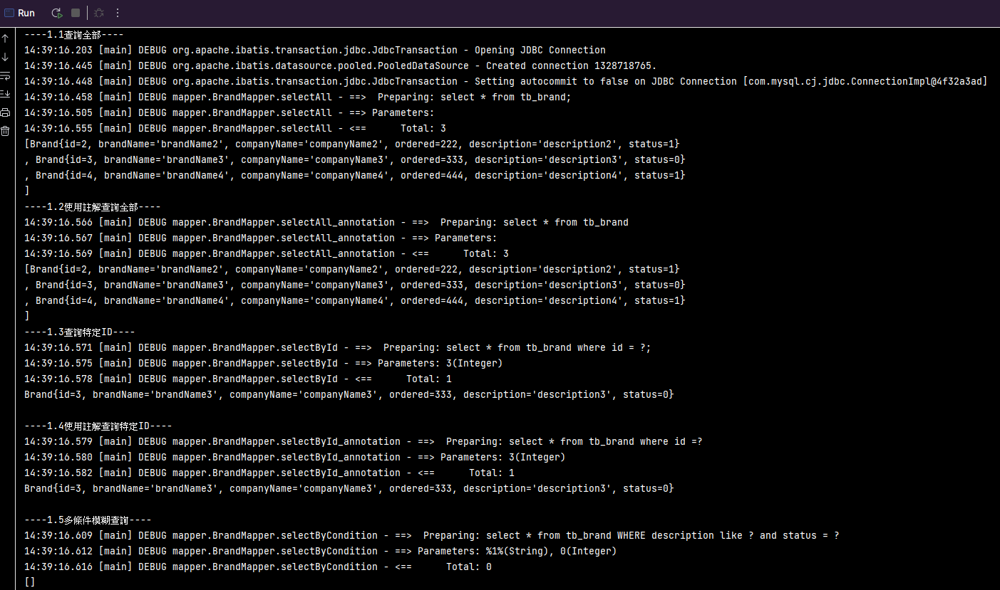
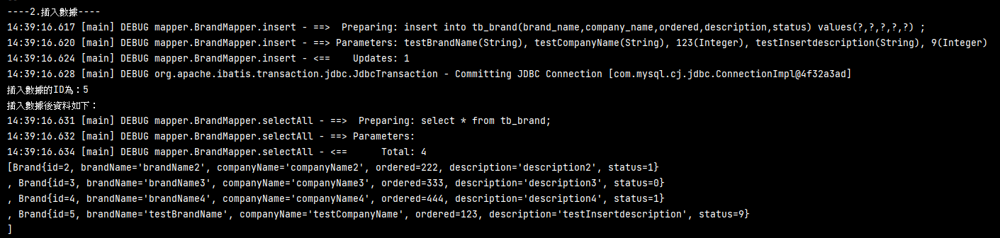
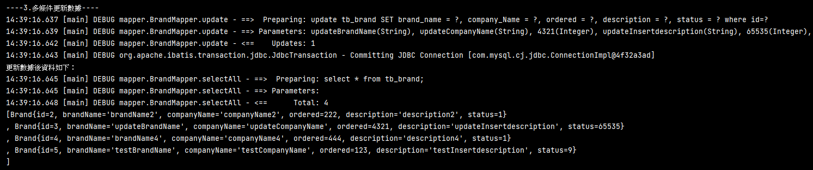
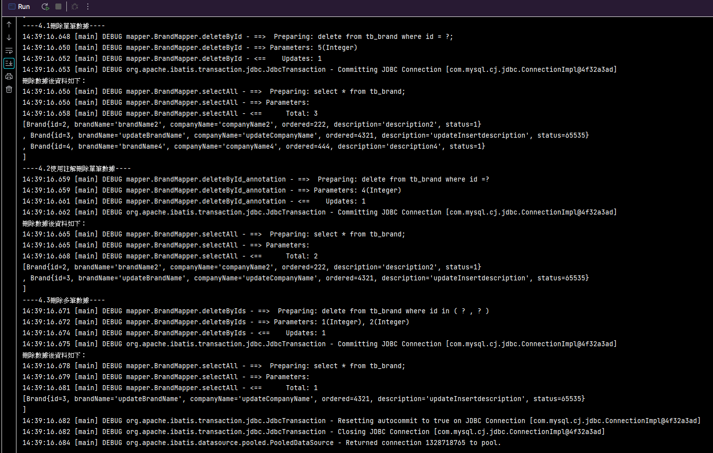

# 說明

* 本練習係使用mybatis進行資料庫CRUD
* 練習內容包含使用SQL映射文件(含動態SQL)、及註解開發
* 使用Junit撰寫方法進行測試
* 練習CRUD內容包含

  * 1.查詢數據
    * 1.1查詢全部
    * 1.2使用註解查詢全部
    * 1.3查詢特定ID
    * 1.4使用註解查詢特定ID
    * 1.5多條件模糊查詢
  * 2.插入數據
  * 3.多條件更新數據
  * 4.刪除數據
    * 4.1刪除單筆數據
    * 4.2使用註解刪除單筆數據
    * 4.3刪除多筆數據
* 測試結果

  * 1.查詢
    
  * 2.插入數據

    
  * 3.多條件更新數據

    
  * 4.刪除數據

    
  *
